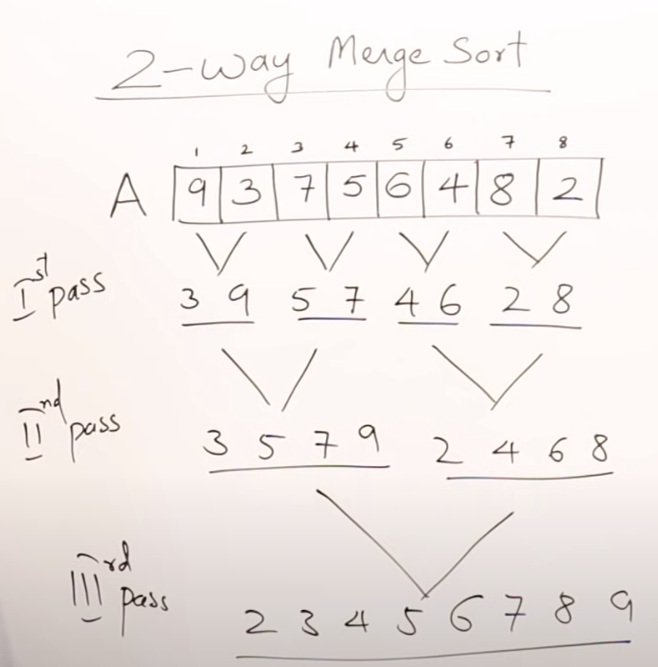

# Contents

- [Divide and Conquer](#Divide and Conquer)
- [General Problems which can be solved using this](#General Problems which can be solved using this)
- [Recurrence Relation](#Recurrence Relation)
    - [Masters theorem decreasing function - https://www.youtube.com/watch?v=CyknhZbfMqc&list=PLDN4rrl48XKpZkf03iYFl-O29szjTrs_O&index=23](#Recurrence Relation#Masters theorem decreasing function - https://www.youtube.com/watch?v=CyknhZbfMqc&list=PLDN4rrl48XKpZkf03iYFl-O29szjTrs_O&index=23)
    - [Masters Theorem for Dividing Functions:](#Recurrence Relation#Masters Theorem for Dividing Functions:)
    - [When passing root n in the recursive call](#Recurrence Relation#When passing root n in the recursive call)
- [Binary Search](#Binary Search)
- [Heap](#Heap)
- [Merge Sort - General O(m+n) -> O(n)](#Merge Sort - General O(m+n) -> O(n))
    - [2-way merge sort O(n log n)](#Merge Sort - General O(m+n) -> O(n)#2-way merge sort O(n log n))
    - [Merge sort Algo - This is divide and conquer O(n log n)](#Merge Sort - General O(m+n) -> O(n)#Merge sort Algo - This is divide and conquer O(n log n))
    - [Pros and Con](#Merge Sort - General O(m+n) -> O(n)#Pros and Con)
- [Quick Sort O(n log n) to O(n^2)](#Quick Sort O(n log n) to O(n^2))
    - [Improvement?](#Quick Sort O(n log n) to O(n^2)#Improvement?)
- [Strassen's Matrix Multiplication](#Strassen's Matrix Multiplication)

# Divide and Conquer

https://www.youtube.com/watch?v=2Rr2tW9zvRg&list=PLDN4rrl48XKpZkf03iYFl-O29szjTrs_O&index=18

Problem of input size P, which has solution S
If P is large, we can divide into smaller problems P1 P2 P3 ....
We can get Solutions for sub problems and get S1 S2 S3

Combine all S1 S2 ... to get S using a METHOD.

Note: Every sub problem is similar to parent problem.
If problem is sort, then sub problem is also sort.

HENCE - Recursive way to solve problem.

# General Problems which can be solved using this
Binary Search
Finding Max and Min
MergeSort
QuickSort
Strassen's Matrix Multiplication

# Recurrence Relation

## Masters theorem decreasing function - https://www.youtube.com/watch?v=CyknhZbfMqc&list=PLDN4rrl48XKpZkf03iYFl-O29szjTrs_O&index=23
Here in recursive call, the next recursion in recursion, n-1 is given as input.

T(n) = T(n-1) + 1     -->  Like a print function O(n)
T(n) = T(n-1) + n     --> *Loop, increment is O(n+1) i++ or i-- --> O(n^2)
T(n) = T(n-1) + log n --> *Loop, increment is O(log n) i * 2    --> O(n log n)
T(n) = 2 T(n-1) + 1   -->  Recursion called twice within function --> O(2^n) 

*Loop inside the recursion function

https://www.youtube.com/watch?v=MhT7XmxhaCE&list=PLDN4rrl48XKpZkf03iYFl-O29szjTrs_O&index=21
Notice: Overall O(n) is just multiply equation by n

T(n) = T(n-1) + 1       --> O(n)
T(n) = T(n-1) + n       --> O(n^2)
T(n) = T(n-1) + log n   --> O(n log n)
T(n) = T(n-1) + n^2     --> O(n^3) 
T(n) = 2 T(n-1) + 1     --> O(2^n)
T(n) = 3 T(n-1) + 1     --> O(3^n)
T(n) = 2 T(n-1) + n     --> O(n2^n)

## Masters Theorem for Dividing Functions:
Here in the recursive call, next recursion in recursion, n/2 is passed as input.
In Binary search uses n/2 since left OR right being processed.

T(n) = T(n/2) + 1     --> O(log n)   - No loop within
T(n) = T(n/2) + n     --> O(n)       - One loop within
T(n) = 2 T(n/2) + n   --> O(n log n) - Two recursion calls
T(n) = 2 T(n/2) + n^2   --> O(n^2) - Two recursion calls
T(n) = 4 T(n/2) + 1   --> O(n^2)
T(n) = 4 T(n/2) + n   --> O(n^2)

Final explanation - https://www.youtube.com/watch?v=OynWkEj0S-s&list=PLDN4rrl48XKpZkf03iYFl-O29szjTrs_O&index=27

## When passing root n in the recursive call

T(n) = T(root of n) + 1   --> O(loglog _base 2_ n)

# Binary Search
https://www.youtube.com/watch?v=C2apEw9pgtw&list=PLDN4rrl48XKpZkf03iYFl-O29szjTrs_O&index=30
https://www.youtube.com/watch?v=C2apEw9pgtw&list=PLDN4rrl48XKpZkf03iYFl-O29szjTrs_O&index=31
Assumed list is sorted
Iterative approach O(1) to O(log n)  -- If search item at middle, O(1)
Recursive approach O(log n)

# Heap
[Heaps](09-Heaps.md) - Main file

# Merge Sort - General O(m+n) -> O(n)
https://www.youtube.com/watch?v=6pV2IF0fgKY&list=PLDN4rrl48XKpZkf03iYFl-O29szjTrs_O&index=33
We have two sorted list. A and B. We make two index i and j
We create third empty list. C. We make an index k for C.
We compare first element in A with first element in B, the smaller of the two is put in C.
We continue till all elements of A and B are compared, and C is full.

Size of A n and B is m. So O(m+n) which is O(n)

If we have multiple lists A B C D E F
Watch --> https://youtu.be/6pV2IF0fgKY?list=PLDN4rrl48XKpZkf03iYFl-O29szjTrs_O&t=529

M-way merging   - Merging M lists - We take M lists, compare all at once then merge.
2-way merging   - Merging 2 lists - We take 2 lists at a time, merge them, then take next list.. so on
4-way merging   - Merging 4 lists - We take 4 lists at a time, merge them, then take next three lists.. so on

NOTE THE DIFFERENCE:
Merge Sort          - This is recursive algo
2-way Merge Sort    - This is iterative algo

## 2-way merge sort O(n log n)
https://youtu.be/6pV2IF0fgKY?list=PLDN4rrl48XKpZkf03iYFl-O29szjTrs_O&t=806

Also watch Optimal Merge Pattern, which two list selected to start with - https://www.youtube.com/watch?v=HHIc5JZyenI&list=PLDN4rrl48XKpZkf03iYFl-O29szjTrs_O&index=42

Image a single list.
Assume each item in list is a list. Each item is not an actual list, its just a number.
So if a list A has 8 items, so we think like we are sorting 8 lists.
But since each item in the list is a number, its already sorted; its just a number.

Jargon - 1st pass, 2nd pass. See image example.

## Merge sort Algo - This is divide and conquer O(n log n)
https://www.youtube.com/watch?v=mB5HXBb_HY8&list=PLDN4rrl48XKpZkf03iYFl-O29szjTrs_O&index=34

Break a list into smaller smaller, half half and perform comparison on last items.

## Pros and Con
https://www.youtube.com/watch?v=ak-pz7tS5DE&list=PLDN4rrl48XKpZkf03iYFl-O29szjTrs_O&index=35

Pros
    Large size list
    Linked List - Only pointer can be changed without creating 3rd empty list
    External Sorting - Image two large files 10gb each. We can bring files in chunks.
    Stable - Duplicates arrangement is also maintained. In a list 2 duplicates, in final sort, 1st duplicate comes before 2nd duplicate.

Cons
    Extra Space (not in place sort)
    No small problem - if n<=15 then merge sort is better
    Recursive - O(n+log n) space where log n is stack space.
    
# Quick Sort O(n log n) to O(n^2)
https://www.youtube.com/watch?v=7h1s2SojIRw&list=PLDN4rrl48XKpZkf03iYFl-O29szjTrs_O&index=36

Imagine a class and teacher asks children to stand in line height wise.
Shortest guy knows he is shortest, goes in front, the tallest at back, and rest speak to each other and sort.

Idea is, each item looks who is infront and back, and stands.
In list, an item only ensures that item on left is smaller and item on right is larger.

This is quick sort.

Jargon - Pivot, Partition

Pivot - The item in the list, from which we start our procedure. It could be 1st item or middle or random.

If Partition done on middle and pivot is 1st item then O(n log n)
If list already sorted, partition in middle and pivot at 1st, worst case is O(n^2)

## Improvement?
Always take the starting pivot as middle element
Maybe one can take a random element as pivot.... but above is better.

# Strassen's Matrix Multiplication
https://www.youtube.com/watch?v=0oJyNmEbS4w&list=PLDN4rrl48XKpZkf03iYFl-O29szjTrs_O&index=38

Time taken to multiply two matrix is O(n^3).
Basically 3 loops are needed to multiply two matrix. That is why O(n^3)

Assumption that dimensions are in power of 2. 2x2, 4x4, 8x8.....
If not in powers of 2, we can fill in 0 to make them in power of two.

Normal multiplication   - O(n^3)
Strassen's              - O(n^2.81) - slightly faster

OPEN PROBLEM - A better way to multiply matrix is needed on earth.

