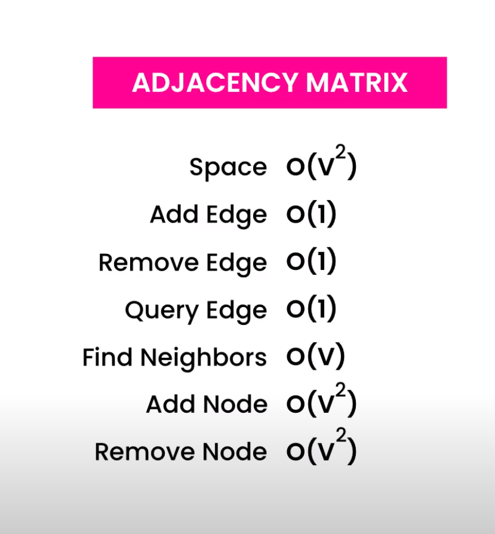

# Contents

- [Graphs](#Graphs)
- [DFS and BFS](#DFS and BFS)
- [Articulation Point and Biconnected Components](#Articulation Point and Biconnected Components)

# Graphs
https://codewithmosh.com/courses/650827/lectures/11654089

A tree is like a graph, just not cyclical
Graph does not have a root, its more like a spider web.

Vertices, Vertex or Nodes
Edges or relations
    Can be undirected
    Directed
        Uni Directed
        Bi Directed
Adjacent or neighbours for connected vertex

https://codewithmosh.com/courses/650827/lectures/11654097
Concept of adjacency matrix - Space --> O(n^2) or O(V^2)
A hash table of each edge can be made to make Time --> O(1)

Concept of adjacency lists - O()

# DFS and BFS
https://www.youtube.com/watch?v=pcKY4hjDrxk&list=PLDN4rrl48XKpZkf03iYFl-O29szjTrs_O&index=61

[BFS and DFS](BFS-and-DFS.md)

# Articulation Point and Biconnected Components
https://www.youtube.com/watch?v=jFZsDDB0-vo&list=PLDN4rrl48XKpZkf03iYFl-O29szjTrs_O&index=62

If there is a node in a graph, which when removed, creates disconnected graphs, then that node is called Articulation Point.
In a computer network or roads we have articulation point, that can break the system. So it should not be there.

How to solve this issue?
We connect two other nodes. So now if two nodes are removed, only then we have failure.

Algo to perform this articulation point finding and then solving it:
https://youtu.be/jFZsDDB0-vo?list=PLDN4rrl48XKpZkf03iYFl-O29szjTrs_O&t=143

1. Perform DFS - get articulation point - Jargon: Discovery Time
2. d - Find discovery times.
3. L - Find lowest discovery. For a node, can we go to parent. If not, then which node we end to.
4. If L(child node) >= d(parent node) <- True.. then parent node is articulation point.
5. 

