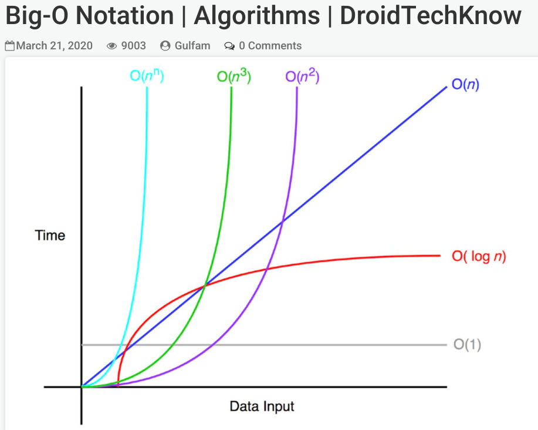
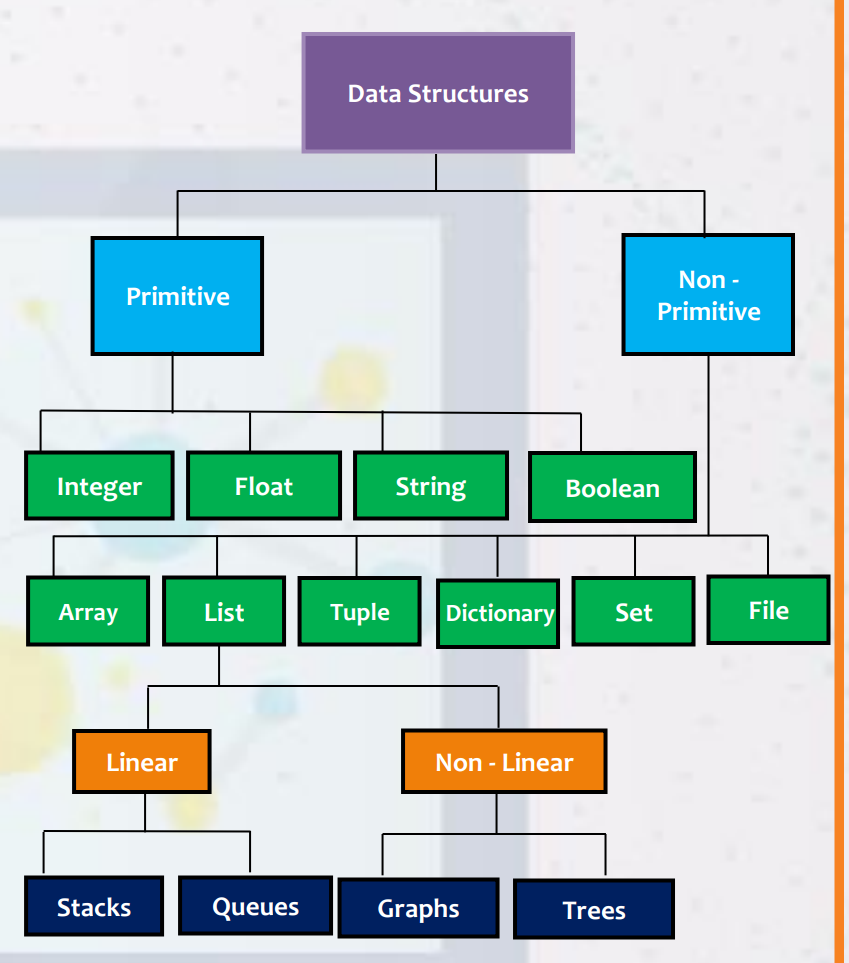
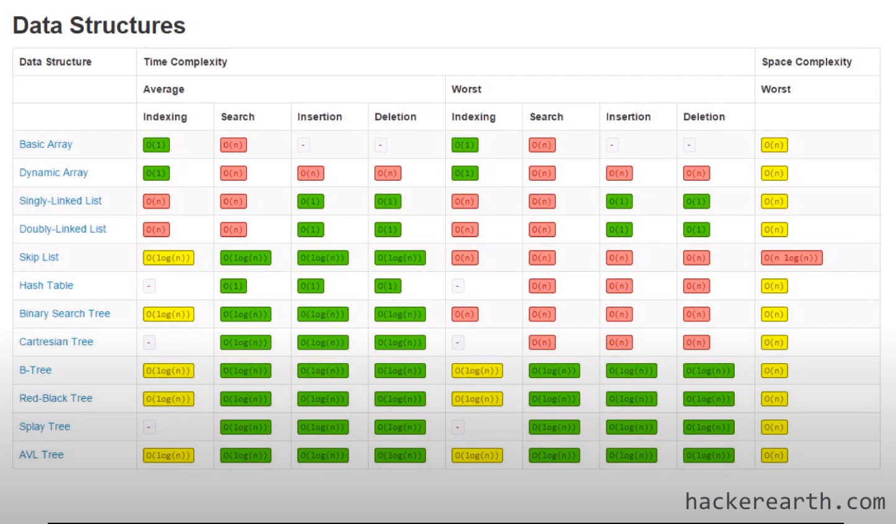
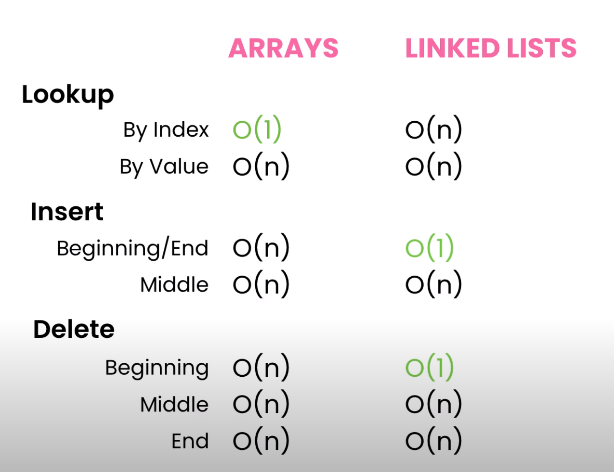

# Contents

- [DSA](#DSA)
- [About](#About)
- [Missing - i think but not sure](#Missing - i think but not sure)
- [Good Links](#Good Links)
- [Cheat sheets](#Cheat sheets)
- [Understanding](#Understanding)
    - [Total Learning](#Understanding#Total Learning)
    - [Flow of solving a problem](#Understanding#Flow of solving a problem)
- [Basics](#Basics)
- [Problem Solving Techniques](#Problem Solving Techniques)
    - [Solving Optimization Problems](#Problem Solving Techniques#Solving Optimization Problems)
    - [Multiple solutions and we want all](#Problem Solving Techniques#Multiple solutions and we want all)
    - [Questions and Answers](#Problem Solving Techniques#Questions and Answers)

# DSA 

# About

Starting by Code with Mosh tutorial.

Teacher Details:
Twitter: https://twitter.com/moshhamedani
Facebook: https://www.facebook.com/programmingwithmosh
YouTube: https://www.youtube.com/user/programmingwithmosh
LinkedIn: https://www.linkedin.com/in/mosh-hamedani/

I have made a folder in this wiki, where all exercise files will go.

# Missing - i think but not sure
Bit Manipulation
Tabulation

# Good Links
https://www.hackerearth.com/

# Cheat sheets

https://www.bigocheatsheet.com/
https://hackingcpp.com/cpp/cheat_sheets.html
https://cheatography.com/burcuco/cheat-sheets/data-structures-and-algorithms/
Python - https://intellipaat.com/blog/tutorial/python-tutorial/data-structures-with-python-cheat-sheet/
Python PDF - https://intellipaat.com/mediaFiles/2019/02/Python-Data-structures-cheat-sheet.pdf

# Understanding

## Total Learning
1. Construct each DS in python.
2. Learn indexing, search, insert, delete and sort in each.
3. Memorise complexity of search and sort in each, from a cheat sheet.
4. Learn complexity of loops
5. Choose iterations or recursion. Recursion is shorter, while iteration seems natural.
6. Practice Brute Force, Dynamic Programming and Greedy Methods

## Flow of solving a problem
1. Visualise and think of which DS to use.
2. Check mathematical answer, if any. -- https://www.geeksforgeeks.org/mathematical-algorithms/
3. Apply Brute Force with loops.
4. Then optimize with Dynamic

Learn to build each DS in a language
Learn to add standard methods to each DS
Traversal in each case

add and remove, in front, in the end, in between
update item
search item
sort item
size of collection
conversion from one collection type to another
error handling if empty
OOP based creating data structures, then adding add, remove etc methods with error handling
next item, previous item, jumping in steps

# Basics

* [01 BigO](01-BigO.md)

Linear Data Structures
* [02 Array](02-Array.md)
* [03 LinkedList](03-LinkedList.md)
* [04 Stacks](04-Stacks.md)
* [05 Queues](05-Queues.md)
* [06 Hash Tables](06-Hash-Tables.md)

Non Linear Data Structures
* [07 Binary Trees](07-Binary-Trees.md)
* [08 AVL Trees](08-AVL-Trees.md) - balancing binary trees
* [09 Heaps](09-Heaps.md) - binary trees with heap properties
* [10 Tries](10-Tries.md) - type of tree but not binary tree
* [11 Graphs](11-Graphs.md) - Modern and versatile
* [12 Uni Directed Graphs](12-Uni-Directed-Graphs.md)

Sort, Search and String Manipulation
* [13 Sorting Algorithms](./sorting/index.md)
* [14 Searching Algorithms](./search/index.md)
* [15 String Manipulation](15-String-Manipulation.md)

* [BFS and DFS](BFS-and-DFS.md) - Graph Traversal Methods

Note:
Array vs LinkedList

Static Array have fixed size, and takes specific memory
Dynamic Array grow by 50%-100% when they get full
But certain operations on LinkedList are faster than array
Its a fine balance of performance and memory

# Problem Solving Techniques
## Solving Optimization Problems

Both are used to solve optimization problems. Meaning where we want to find min or max

* [01 Dynamic Programming](01-Dynamic-Programming.md) - Has no constrain, hence need accuracy
* [02 Greedy Algorithms](02-Greedy-Algorithms.md)   - Has constrain, so we solve for it, result is per the constrain.

## Multiple solutions and we want all

* [03 Back Tracking](03-Back-Tracking.md) - DFS
* [04 Branch and Bound](04-Branch-and-Bound.md) - BFS  - Also used for solving optimization problems
* [05 Divide and Conquer](05-Divide-and-Conquer.md)

## Questions and Answers

[Neetcode](./neetcode/index.md)
