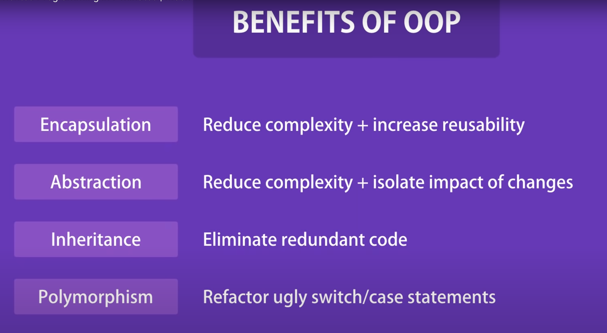

# Objective

To put in OOP principles in one place.
Comparing all programming languages I learn.

# Introduction
OOP forms the base to the best coding practices and handling large code base.
Foundation for [Design Patterns](../design-patterns/index.md)

# Common Terms
Classes         - Parent, with variables and methods.
Constructors    - Class contains a root method, which is a blueprint to create basic object.
Objects         - When class is used to create usable items, called objects.
Abstract Class  - This can not be instantiated, object can not be made from it. Only child class can extend from it.
Interface       - Like abstract class, but this can not have any method implementation. These have only method signatures.
    - extends: use this on interface to create another interface.
    - implements: use this on interface to create a concrete class from interface.
Concrete Class  - This is an actual class created from abstract class or interface
Generic Class   - In typeScript Course - https://codewithmosh.com/courses/1779784/lectures/40256281

Coupling        - If user class changes, main class breaks and also all other classes are to be re-compiled
Interfaces      - To address coupling issue, interface is made. A template to create class. In python its called abstract class. Keywords - implements override
Static Methods  - These can only be accessed from the class level, not object level. These have one memory location.

# Common Practices
Define class and using constructors - Basic
Accessing Properties and methods - this, self
Making properties read-only    - Disabling users from changing exposed internal vars.
Access Modifiers             - Control vars and methods view to user. Private, Protected, Public
Getters and Setters         - Expose vars and methods to user in controlled manner.
Index Signature             - Seen in typescript only
Creating Static members     - Common location in memory. Access by class, not object.
Inheritance                 - extends keyword
Method override         - Changing class method by object in its own instance.
Abstract Method         - No body, only signatures and methods
Interface               - implements keyword
Generics                - This format -> ClassName<K,V>. Making reusable classes, interfaces and functions.
Decorators              - Enhancing classes, methods etc

# Pillars of OOP

Encapsulation - If we need validations in setting a variable given in parent class, so we make private variables in user class, and change them using getter and setter with validations as needed. 
Abstraction - Removing complexity from end user and then creating a parent method, by chaining complex methods and expose parent method to user. Keyword: private public OR __ in python
Inheritance - Inheriting methods and vars from parent
Polymorphism - Many forms. Object instance having many forms. Abstract class in JAVA. Keywords - extends and override.
Composition - When we create class by combining various other classes as needed.

More on polymorphism -->
Make a Parent Class with Methods
Make multiple child class from parent using extends
Override the methods as needed.
Create instance objects from child classes.
In the end, you have multiple child, who act differently coz of override BUT create from a single source.

Note sure how this is different from interface or abstract class. Sounds the same.

[UML](../design-patterns/UML.md) - Unified Modeling Language - https://codewithmosh.com/courses/759570/lectures/13732320

# Modern Software Design
https://www.arjancodes.com/mindset

## Mastering The Tools
* Types And Type Hints - Knowing what types and type hints are and how they work in Python is really important. In this lesson I dive into the details of type systems, how things work in Python, and show you best practices so you get the most out of using type hints.
* Data Structures - A core piece of software design is using data structures correctly. Each data structure has its own pros and cons. Knowing about these is going to help you take better decisions about which data structure to use when.
* Classes And Data Classes - Though this is not a complete introduction of object-oriented programming, I talk about classes and data classes in detail in this lesson and how they fit into software design.
* Inheritance, ABCs And Protocols - In the final lesson of this module, you learn about abstraction, which is a core element of software design. I cover the various ways in which you can achieve abstraction in Python to help you choose the best option for your design.

## Principles
The second part of the course presents the 7 Principles Of Modern Software Design. It takes many of the existing design principles and adapts them to the needs of the modern software designer. It goes way beyond object-oriented design by teaching you generic principles that apply to any programming language and paradigm, whether that’s object-oriented, purely procedural, or functional.
* Single Responsibility Principle - Each class should do only one thing.
* Open Closed Principle           - Class should be OPEN for extension and CLOSED for modification.
* Change in one class should not affect other classes - Iterator pattern
* Favor Composition Over Inheritance - Learn how to approach inheritance in code and use it in a balanced way by looking at several code examples.
* High Cohesion - Various techniques for making sure that the code you write has clear responsibilities.
* Low Coupling - Learn how to reduce coupling between different areas of your application so that your code is easier to maintain in the future.
* Start With The Data - What role does data play in the design process? When should we think about data and data structures in software design? And what is a practical process for modeling the data structures in your software?
* Depend On Abstractions - Abstractions such as ABCs and Protocols help reduce dependencies. In this lesson I show you how to use these abstractions effectively.
* Separate Creation From Use - You learn different ways of creating objects in a software system, and how to have better control as a software developer over how and when objects are being created.
* Keep Things Simple - As a software developer, how do you keep things simple? I talk about different ways to make sure your code stays simple, even if the application itself is complex.

## Being A Responsible Developer
* Mixins - You learn what Mixins are, why you need to be very careful with them, and what the much better alternatives are.
* Dealing With Errors - Any application has to properly deal with errors. Here you learn how error handling works in Python, what the different possibilities are as well as some of the more advanced error handling mechanisms such as context managers.
* Setting Up A Complex Software Project - Learn about files, folders, modules, packages, absolute and relative imports. Learn how to structure your code properly, and what should generally be in a code repository.

