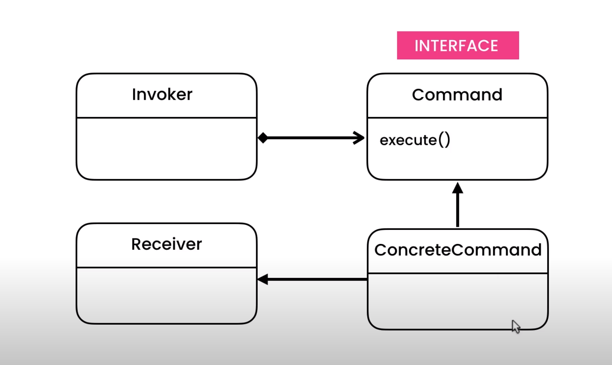

https://codewithmosh.com/courses/759570/lectures/13732502
https://codewithmosh.com/courses/759570/lectures/13732500

Concept of Frame Work.

Imagine a button class.
Which has label and a thing it can do.

Now a service can use this button. And what the button does, depends on this service class.

How?
We make a button class with an action define.
This action, calls a method from command class.

Now, there is a service class, which has button, and action is add customer.
This add customer action calls add customer class.
This add customer class calls method from the command class.

Invoker class talks to command interface.
Concrete command class talks to command interface too.
Receiver class talks to concrete command class.

Here Invoker class and command interface is called Framework.
