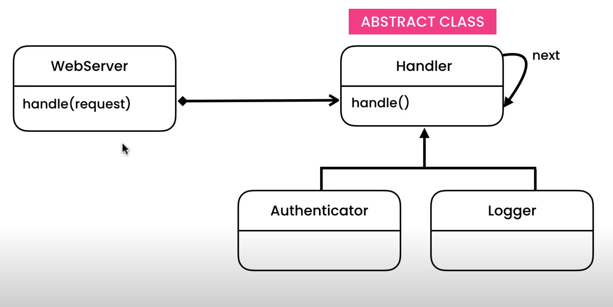

https://codewithmosh.com/courses/759570/lectures/13732573

Concept of pipeline.

Looks similar to state again, BUT here we have a class which has a handler.

There is an Abstract class called Handler. This has pipeline of things to do.
The things, which is does is calling other classes, one by one in sequence.

The main class, talks to the handler class, and handler class calls required classes with methods in pipeline style.
