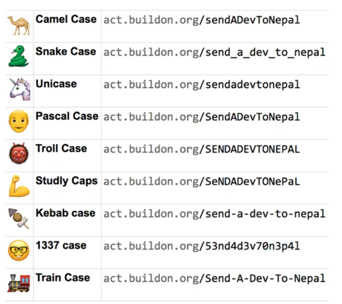

# Contents

- [Objective](#Objective)
- [My List](#My List)
- [Language Learning Template](#Language Learning Template)
    - [Language independent basics to know](#Language Learning Template#Language independent basics to know)
    - [Individual Language Template](#Language Learning Template#Individual Language Template)
        - [Basic](#Language Learning Template#Individual Language Template#Basic)
        - [Advance](#Language Learning Template#Individual Language Template#Advance)
        - [Pro](#Language Learning Template#Individual Language Template#Pro)
        - [Application Building](#Language Learning Template#Individual Language Template#Application Building)
        - [Team work and Other](#Language Learning Template#Individual Language Template#Team work and Other)
    - [Modern Software Design](#Language Learning Template#Modern Software Design)
        - [Mastering The Tools](#Language Learning Template#Modern Software Design#Mastering The Tools)
        - [The 7 Principles Of Modern Software Design](#Language Learning Template#Modern Software Design#The 7 Principles Of Modern Software Design)
        - [Being A Responsible Developer](#Language Learning Template#Modern Software Design#Being A Responsible Developer)
- [Core Concepts](#Core Concepts)
    - [Software Design Patterns](#Core Concepts#Software Design Patterns)
    - [Architectural Patterns](#Core Concepts#Architectural Patterns)
    - [Difference Between Solution, Enterprise and Software Architects](#Core Concepts#Difference Between Solution, Enterprise and Software Architects)
    - [Jargon](#Core Concepts#Jargon)

# Objective

Purpose is to learn and know 10 programming languages, with OOP and what each is best at.
I wish to do it in the next 1 year.

https://appetiser.com.au/blog/the-most-loved-and-hated-programming-languages-according-to-developers/

# My List

* [Python](./python/index.md)   <-- Data science, large no. for libraries and good support. Very slow.
* [Javascript](./javascript/index.md), [TypeScript](./typescript/index.md) and [NodeJS](./nodejs/index.md) <-- Mostly in web development.
* [SQL](./sql/index.md)      <-- DB tech
* [Solidity](../blockchain/Solidity.md) <-- For EVM for making smart contracts
* Rust     <-- Very fast and fast builds
* Go       <-- Very fast and fast builds
* Swift    <-- Dont know, pretty famous, learn more
* Java     <-- Fast but verbose, used a lot. Core to understand DSA and LLD
* C        <-- Close to assembly language, not much used.
* C++      <-- Fastest, old and widely used
* C#       <-- Not sure about it, I think micrsoft made it maybe; need to check
* WebAssembly (WASM) <-- Used instead of javascript for internet.... Very fast
* Clojure  <-- High Salary - Data centric
* Dart     <-- Pretty fast
* [Elixir](./elixir/index.md)   <-- High Salary - Very fast with concurrency
* Scala    <-- Pretty famous

# Language Learning Template
Static typed - If we can not change variables later. Define type initially.
Dynamic typed - If we can change variables later. No need to define type.

## Language independent basics to know

[General Basic Grammer](General-Basic-Grammer.md)

The below are applied to all languages and should be learnt as they are what is asked in interviews.
Its not about interview, in general it is easier to learn a new language if you know the below.

1. LLD  - Design Patterns, mostly OOP based.
2. SOLID PRINCIPLES by uncle bob - Using LLD and OOP to write complex, extendable, stable code.
3. HLD  - System design, not a must, but good to know, as they become motivation for learning.
4. DS   - Data Structures. Which is good for what. Add, remove, traverse, sort and search.
5. Algo - Greedy, Dynamic, Loops and Recursion.
6. CS Jargon - What is what, most important.

## Individual Language Template
Once you know the following, you can say you know the language.

### Basic
1. 4 pillars of OOP - Encapsulation, Inheritance, Abstraction and Polymorphism.
2. Variables, Constants, Primitive Types (string, int etc), Reference Types (Objects, Arrays, Functions)
3. Operators - Arithmetic, Assignment, Comparison, Equality, Ternary, Logical, Bitwise
4. Control Flow - if else, switch, for, while, do, break, continue.
5. Garbage Collection and Memory Management.

### Advance
1. Refactoring - Splitting code into files or modules
2. Parameterizing - Not hard coding variables, each variable can be input later.
3. Error Handling (try catch) - Custom Errors for things which do not work.
4. Coding Style Guide Knowledge for the language - What to be placed where.
5. Code formatting and linting - Proper tabs and spaces and comments.
6. Doc String or JSDocs - Comments for auto documentations.
7. Testing (Unit, Integration, System and Acceptance) - https://www.geeksforgeeks.org/software-testing-basics/
8. Concurrency, Parallelism, (Thread, Processes), Asynchronous - https://medium.com/swift-india/concurrency-parallelism-threads-processes-async-and-sync-related-39fd951bc61d
9. Packaging and uploading to repo.

### Pro
1. Contributing to other projects on github
2. Wrapping different language libraries into different. Like bringing in c++ lib to python wrapper.

### Application Building
1. Famous Frameworks
2. Script, GUI and CLI. Desktop, Web and Mobile.

### Team work and Other
1. Git complete
2. Docker complete

## Modern Software Design
https://www.arjancodes.com/mindset

### Mastering The Tools
* Setting Up Your Development Environment - Learn how to setup your development environment for success (this is more important than you think): which plugins/extensions to use and what settings to change to make your life easier.
* Types And Type Hints - Knowing what types and type hints are and how they work in Python is really important. In this lesson I dive into the details of type systems, how things work in Python, and show you best practices so you get the most out of using type hints.
* Data Structures - A core piece of software design is using data structures correctly. Each data structure has its own pros and cons. Knowing about these is going to help you take better decisions about which data structure to use when.
* Classes And Data Classes - Though this is not a complete introduction of object-oriented programming, I talk about classes and data classes in detail in this lesson and how they fit into software design.
* Inheritance, ABCs And Protocols - In the final lesson of this module, you learn about abstraction, which is a core element of software design. I cover the various ways in which you can achieve abstraction in Python to help you choose the best option for your design.

### The 7 Principles Of Modern Software Design
The second part of the course presents the 7 Principles Of Modern Software Design. It takes many of the existing design principles and adapts them to the needs of the modern software designer. It goes way beyond object-oriented design by teaching you generic principles that apply to any programming language and paradigm, whether that’s object-oriented, purely procedural, or functional.

* Favor Composition Over Inheritance - Learn how to approach inheritance in code and use it in a balanced way by looking at several code examples.
* High Cohesion - Various techniques for making sure that the code you write has clear responsibilities.
* Low Coupling - Learn how to reduce coupling between different areas of your application so that your code is easier to maintain in the future.
* Start With The Data - What role does data play in the design process? When should we think about data and data structures in software design? And what is a practical process for modeling the data structures in your software?
* Depend On Abstractions - Abstractions such as ABCs and Protocols help reduce dependencies. In this lesson I show you how to use these abstractions effectively.
* Separate Creation From Use - You learn different ways of creating objects in a software system, and how to have better control as a software developer over how and when objects are being created.
* Keep Things Simple - As a software developer, how do you keep things simple? I talk about different ways to make sure your code stays simple, even if the application itself is complex.

### Being A Responsible Developer
* Mixins - You learn what Mixins are, why you need to be very careful with them, and what the much better alternatives are.
* Dealing With Errors - Any application has to properly deal with errors. Here you learn how error handling works in Python, what the different possibilities are as well as some of the more advanced error handling mechanisms such as context managers.
* Setting Up A Complex Software Project - Learn about files, folders, modules, packages, absolute and relative imports. Learn how to structure your code properly, and what should generally be in a code repository.

# Core Concepts

## Software Design Patterns
Book - Design Patterns by Gang of Four LOL
https://youtu.be/tv-_1er1mWI?t=33

Look Link --> https://refactoring.guru/design-patterns/

C --> Creational Patterns
S --> Structural Patterns
B --> Behavioural Patterns

Singleton   - C - Only once instantiated.
Prototype   - C - Inheritance from object created object, rather the class.
Builder     - C - Create object in step by step using methods instead of constructor, which does all at once. Chaining methods.
Factory     - C - Instantiate from method or function rather than a variable manually.

Facade      - S - Abstract away details. Make a sub class (facade) and create methods from parent complex class. Combining methods and functions to give final easy methods and functions to sub class.
Proxy       - S - Replace original with a proxy, then work on proxy, in the end handle actual object.

Iterator    - B - Normal iterations in steps. Pull Based System.
Observer    - B - Push Based system. One to Many relationship. Pub Sub kind of model, where one event broadcast and many listen. Kafta Redis RabbitMQ type.
Mediator    - B - Many to Many relationship. Many broadcast, many consume type.
State       - B - Using conditional logics and switch statements to make object behave differently. OR create different class for different states. [refer this part of video](https://youtu.be/tv-_1er1mWI?t=629) interface, then class implements... is used.

THEN there is MONADS https://www.youtube.com/watch?v=VgA4wCaxp-Q
Here aim is to make class chainable, which enables pipeline style of working.

## Architectural Patterns
Video --> https://www.youtube.com/watch?v=BrT3AO8bVQY

Layered Pattern or n-tier architecture (Poor performance)
    Presentation Layer
    Application Layer
    Business Logic Layer
    Data Access Layer

Pipe-Filter Pattern
Shoot an event after event, piping the actions.
Input > Pipe > Filter > Pipe > Filter ... > Output    

Client-Server Pattern (communication with API)
    Client
    Server
    
MVC - Model View Controller Pattern (Used in Django and Rails)
    Model -- update view
    View  -- seen by user
    **End User  -- uses controller (not part, just to demonstrate the flow)
    Controller -- manipulates model

Event Bus Pattern (scalability kind of issue)
Sounds like Broker pattern
    Event Source (Publisher)
    Event Bus (Ditributor like rabbitmq redis kafka)
    Event Listener (Subscriber)
    
Micro-services Architecture Pattern
    Client - Front Ends
    API gateways
    Services - Backend
    
Broker Pattern
Its like micro-services, but uses broker in between rather than direct API gateways.
    Client
    Broker (RabbitMQ/ redis type system)
    Services
    
Peer-to-peer pattern (highly scalable, distributed)
Every participant is client and service at the same time. Blockchain, IPFS are examples.

Blackboard Pattern
When no deterministic patterns are known. Pattern matching done.
    Blackboard (like a global memory containing objects)
    Knowledge Source (specialised modules with their own representation)
    Control Components (selects configures the modules in knowledge source)
Input > Blackboard > Notify Controller > Enrolls Knowledge Source > Updates Blackboard
Used in speech recognition, protien structure analysis

Master-Slave Pattern (only if problem can be decomposed, this can be used)
    Master
    Many Identical Slaves

Master distribute work to slaves, slaves give back result to master and master combines and gives output. Loosely like Concurrency or asyncio or threading.
Remember the corrlation of all symbols to all symbols I made. Now processing in python was very slow due to single core execution. I wanted to execute it in multiple cores, hence I needed to decompose the problem so that it can be done on multicore. Solution is to use permutations on list of symbols, in group of 8s (number of cores), then execute the correlation function.

## Difference Between Solution, Enterprise and Software Architects
https://www.youtube.com/watch?v=zB9WuYE1REI

UML --> Unified Modeling Language
Visualizing how software works

Requirements (objective) > User Stories (what, how etc) > Format for engineers (UML)

## Jargon

TDD - Test Driven Development
Multi Paradigm Languages - Meaning all types of programming styles allowed. Like python and Javascript.

Dynamic programming     -- Cacheing results
Greedy Algorithm        -- Find fastest solution

Reactive Programming    -- Event driven
OOP                     -- Data object based
Functional Programming  -- By functions and sequence
Procedural Programming  -- In sequence procedures
Aspect-Oriented

refactoring - Breaking up a big code into smaller chunks
paramatrizing - Not hard coding variables, rather passing variables its value from other variables or list

[Link to testing, wrt solidity](https://youtu.be/gyMwXuJrbJQ?t=40116)
unit test - testing our small portion, sections of code like functions individually using asset and all
staging or integration tests - code base as a whole is tested, in largest chunks. This is LAST STOP, just before actual deployment.

https://www.youtube.com/watch?v=-uleG_Vecis

Turing Machine
Bit, Byte
ASCII
Binary, Hexidecimal
Nibble - 4 bit group
Machine Code
Memory Address on RAM
I/O
Kernels                 - Speaks to hardware
Shell                   - On top of Kernel, entry point for user
CLI                     - Command Line Interface to connect with local shell
SSH                     - Secure Shell Protocol to connect to computers over network
Abstraction Principal   - Hide complexities and give a simple interaction
Interpreted Language    - A program Line by line execute on cpu
Complied                - As a whole converted to machine code and then sent to cpu
Executable              - Stand Alone file to run a program without dependencies
Data Types              - String, Bitmap, Bitfield, Hash, List, Set, Sorted Set, Geospatial, Hyperlog, Stream
Dynamically Typed       - No need to tell data types of varibales at declaration (eg python)
Statically Typed        - Data types for each variables must be defined at declaration (javascript, solidity)
Pointer                 - It is a variable whos value is memory address of the other variable
Garbage Collector       - No one wants to manage memory at low level, hence garbage collector is used.

Int     : Signed or unsigned eg signed allows negative numbers
Floating Point/ Float
Double  : Float to use double the memory for higher accuracy
Char    : Single alphabet
String  : Multiple alphabets
Boolean : true false

Big Endian: If order in memory starts with most significant byte is stored in smallest memory address
Little Endian: When least significant byte is stored in smallest memory address

Data Structures
    Array - list style [ ]
        List - Indexed [ 0 1 2 3 ... ]
        Linked List - Each item has pointer to the next item
        Stack - LIFO - last in first out
        Queue - FIFO - first in first out

    Hash, Dictionary or Map, all is same - Linear way to store data - key value pair style { }
    Trees - Since organising data in linear way is not efficient 
            in traversing, trees are used which stores data in heirarchy
    Graph - Trees are very rigid kind of data structure, hence graph is used where
            1. Nodes - The data itself
            2. Edge - Relationships 

Algorithm
    Function - Takes input with arguments and returns output
    Void Function - Does not return anything
    Operators like > != etc
    Expression - Code that Produces value: a_is_bigger = a > b; Gives true or false
    Statement - Code that does something; if a: {do something} else {do something else}
    Conditional Logic, if else while
    Loop is for Iterable data type: for
    Recursion:  when function calls itself, essentially forming a loop
    Call Stack - In recursion, each time function run, in short term memory function is put in call stack
    Stack Overflow Error - When memory gets full due to call stack, we get stack overflow error
    Base condition - Needed to stop the recursion or loop to prevent stack overflow error
        eg if i > 10;
    
    Big-O Notation - Approcimate the performance of algorithm at scale eg O(n) O(1) O(log n) O(n!) O(n^2) O(2^n)
        Time Complexity - How much time taken, how fast
        Space Complexity - How much memory used
    
    Types
        Brute Force - Try out each and every combination, like in hacking passwords
        Divide and Conquer - Like binary search, dividing problem in halves
        Dynamic Programming - Problem divided into smaller sub problems and output 
                              of each sub problem is cached so that it can be used later 
                              by other sub problems
            Memoization - Technique where existing value is used instead of calculating 
                          from scratch. In the dynamic programming. 
        Greedy Algorithm - Finds result by making choice most beneficial in short term
                           without considering problem as a whole, hence ignoring the 
                           best/ optimal solution.
            Example - Dijkstra's Shortest Path Algo
        Backtracking Algorithm - Incremental way looking at all options before making a choice.
        
Implementing Code
    Declarative - describes what program does and the outcome. Ignores control flow.
        Functional Languages like Haskell uses it.
    Imperative - Uses statements like if's and while loops, to explicitly tell how to produce outcomes. Procedural programming language like C uses it.
                 
General Purpose Languages - Like python, javascript Kotlin swift, which can be used for anything
Multiparadigm Languages -   They support declarative and imperative style of coding at the same time general purpose languages are usually multiparadigm

Object Oriented Programming
    Classes -     Like a main head function
    Properties -  All variables in the classes
    Inheritance - Sharing behaviours between classes. Example, make a class1 and then class2
                  which takes a copy class1, called inheritance and then add / modify functionalities.
                  This opens to a new topic called Design Patterns
    Design Patterns - The way we build various classes and how inheritance done, various studies on it.
    Instantiate - Class does not do anything by itself. Hence it is instantiated into a variable
                  where they are used and actual data lives in the memory.
    Heap - When a class is instantiated into multiple variables, it takes space in the memory, which
           we know that in case of recursion used call stack; but here instead of call stack HEAP is used
           since the data has to be long lived. In case of call stack, data in memory is not long lived.
    Reference - Objects passed by reference means that the same object can be used in multiple varibales
                without increasing data memory footprint, since only pointers are used to refer data.

Threads - Takes physical CPU core and breaks into multiple virtual cores called threads.
Parallelism -  Programming languages when run code in multi-thread by default
Concurrency -  But most languages are single threaded, hence 
               to enable multi thread processing, concurrency is used.
    Event loops
    Co-routines

Bare Metal  -  Directly working on physical computer
Cloud       - Working in a virtual machine created on a remote server and working on that.
Virtual Machine - A piece of software which simulates a bare metal machine hardware. Big fast computers this way divided into smaller computers.

Networking  - Connecting various computers together
IP Address  - A number address, which points to a machine in a network
URL         - An alias of IP address, since IP are like numbers, we wrap a name, like google.com
DNS         - A kind of register, which IP address points to which URL, kind of table is present.
TCP         - Transmission Control Protocol. When two computer need to establish connection. a handshake is needed, which is done by TCP handshake.
Packets     - Once by using TCP, two computers connect, now they can exchange data, in small chunks called packets
SSL         - Secure Sockets Layer - Now if packets are shared on the internet, they can be viewed by anyone, Hence we secure the packets with encryption and decryption using SSL
HTTP        - Now we have connection with TCP, packets of data is ready and SSL secured them,now we use HTTP, Hyper Text Transfer Protocol, which allows the actual sharing of data.
API         - Application Programming Interface. This is they way data is requested using HTTP.
URI         - Uniform Resource Identifier - Like in API, the links to methods of calling specific data from URL
URL         - Uniform Resource Locator - This is location to the data itself
