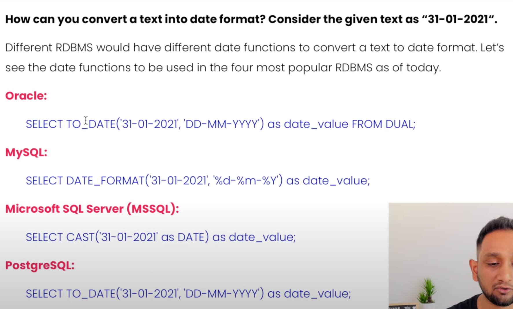

# Contents

- [Essential Functions](#Essential Functions)
- [Numeric](#Numeric)
- [STRING](#STRING)
- [Date and Time](#Date and Time)
    - [Usual](#Date and Time#Usual)
    - [Formatting](#Date and Time#Formatting)
    - [Calculations on Data time](#Date and Time#Calculations on Data time)
- [IFNULL and COALESCE](#IFNULL and COALESCE)
- [IF and CASE](#IF and CASE)

# Essential Functions
https://www.w3schools.com/sql/sql_ref_sqlserver.asp
https://dev.mysql.com/doc/refman/8.0/en/numeric-functions.html

# Numeric
ROUND(5.5523, 3)    -- Round to 3 digits
TRUNCATE(5.5523, 3) -- Just remove 3 digits
CEILING(5.5523)     -- Just remove 3 digits
FLOOR(5.5523)       -- Just remove 3 digits
ABS(5.5523)         -- Just remove 3 digits
RAND()              -- random btw 0 and 1

# STRING
LENGTH
UPPER
LOWER
LTRIM
RTRIM
TRIM
LEFT
RIGHT
SUBSTRING("mANASVASDASD",2,5) -- Start from 2 and select 5
LOCATE('m','ASDJHASMASD')     -- return index of 1st appearance of a substring. Not case sensitive.
REPLACE
CONCAT

# Date and Time
https://codewithmosh.com/courses/525068/lectures/9590261

## Usual
NOW
CURDATE
CURTIME
YEAR(NOW()), MONTH DAY HOUR MINUTE SECOND DAYNAME MONTHNAME
EXTRACT(DAY FROM NOW())

## Formatting
DATE_FORMAT(NOW(),'%m %d %Y') -- Google it for full list

## Calculations on Data time
https://codewithmosh.com/courses/525068/lectures/9590267

DATE_ADD(NOW(), INTERVAL 1 DAY)
DATE_ADD(NOW(), INTERVAL 1 YEAR)
DATE_ADD(NOW(), INTERVAL -1 YEAR)
DATE_SUB(NOW(), INTERVAL 1 YEAR)
DATE_SUB(NOW(), INTERVAL -1 YEAR)
DATEDIFF('2019-01-05','2019-01-01')   -- Gives 4, returns days always, even if you give time.

TIME_TO_SEC('9:00') - TIME_TO_SEC('9:02') -- Gives -120 seconds

# IFNULL and COALESCE
https://codewithmosh.com/courses/525068/lectures/9590263

USE database
SELECT 
    col1,
    IFNULL(col2, 'Custom Message') AS something
    -- COALESCE(col2, col3, col4, 'Custom Message') AS something
FROM table

Note IFNULL replace null with one message
COALESCE will 1st check col2 for null, then col3 for null ... and if all null, then give the custom message
In case, between various col2, col3 we find value, we fill that in the something col.

# IF and CASE
https://codewithmosh.com/courses/525068/lectures/9590265

IF(expression, ifTrue, ifFalse)

https://codewithmosh.com/courses/525068/lectures/9590268

SELECT *
    CASE
        WHEN YEAR(date_col) = YEAR(NOW()) THEN 'Active'
        WHEN YEAR(date_col) = YEAR(NOW()) - 1 THEN 'Last Year'
        WHEN YEAR(date_col) < YEAR(NOW()) - 1 THEN 'Archive'
        ELSE 'Future'
    END AS Category
FROM table
