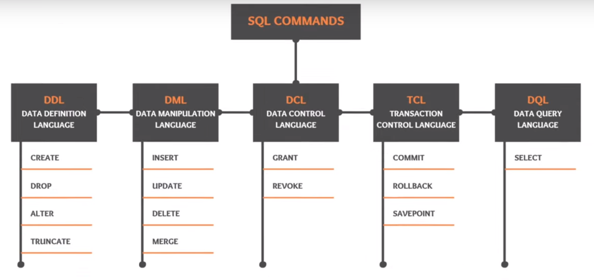

# Contents

- [SQL](#SQL)
- [Sections](#Sections)
- [Data Types](#Data Types)
- [Column Attributes](#Column Attributes)

# SQL

# Missed Out
https://www.youtube.com/watch?v=AK7_m-aThfw

Window Functions
RANK, DENSE_RANK, ROW_NUMBER, LEAD, LAG, CUM_DIST, NTILE, NTH_VALUE, PERCENT_RANK, FIRST_VALUE, LAST_VALUE

Using aggregate functions as window functions. Using --> over()
SELECT SUM(colName) over() AS col_aggregate
FROM table;

Synonym vs Views vs Materialised Views??

MERGE statement

Difference between function and procedure

Pragma Autonomous Transactions

# Sections
[Query](Query.md)
[Joins](Joins.md)
[Insert Update Delete](Insert-Update-Delete.md)
[Summarizing Data](Summarizing-Data.md)
[Complex Queries](Complex-Queries.md)
[Essential Functions](Essential-Functions.md)
[Views](Views.md)
[Stored Procedures](Stored-Procedures.md)
[Triggers and Events](Triggers-and-Events.md)
[Transactions and Concurrency](Transactions-and-Concurrency.md)
Data-Types
Designing-Database
Indexing-for-High-Performance
[Securing Databases](Securing-Databases.md)

# Keywords
Check it out, not sure what they do

NEW
OLD

# Data Types
INT()
CHAR()
VARCHAR()
DATE

# Column Attributes
PK  - Primary Key
NN  - Not Null. Can not be empty
UQ  - Unique Key, confirm, not sure
BIN
UN
ZF
AI  - Auto Increment. Like PK can be AI as well.
G
Default/ Expression - If no value given, then what is to be filled. Like NULL.
