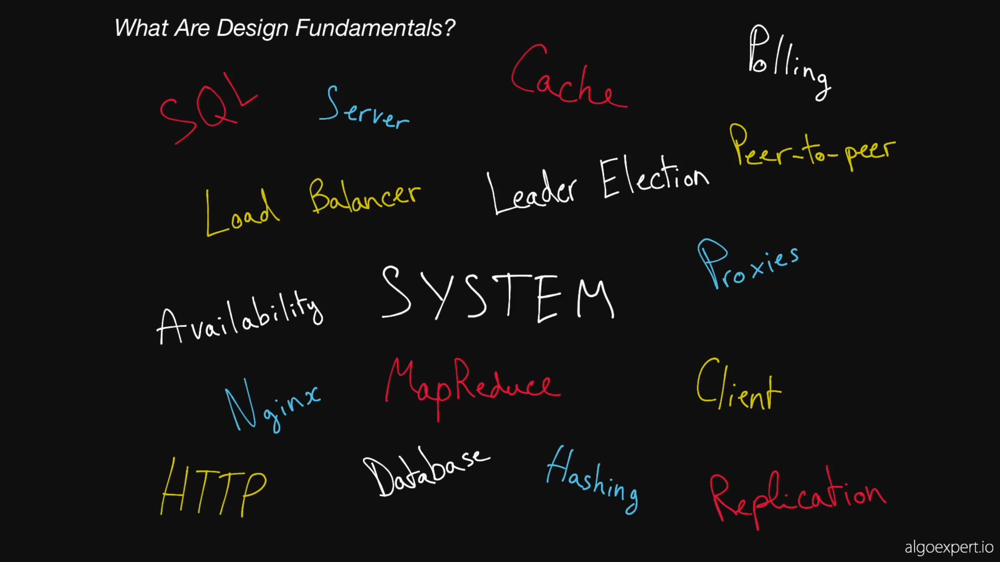
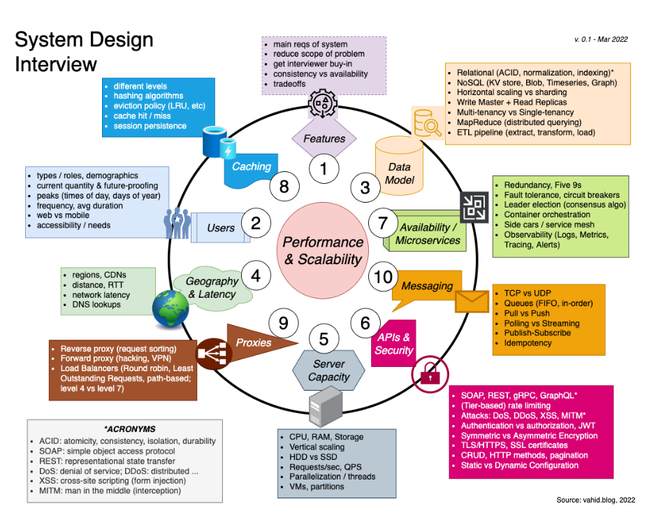

# System Design

Reference from --> https://www.algoexpert.io/systems/fundamentals

Its all about performance, scaling and security

Cheat Sheet --> https://vahid.blog/post/2022-05-05-system-design-interview-cheat-sheet/
Info Graphic --> 

Software Design Architecture - https://martinfowler.com/architecture/

Good Playlist - https://www.youtube.com/watch?v=gxfERVP18-g&list=PL4JxLacgYgqTgS8qQPC17fM-NWMTr5GW6&index=2

# Rajdeep Saha Udemy Course
https://www.udemy.com/course/rocking-system-design/learn/lecture/26100198#overview

[Rajdeep Saha System Design AWS](Rajdeep-Saha-System-Design-AWS.md)

# Fundamentals
https://www.youtube.com/watch?v=REB_eGHK_P4

1. Load Balancing - Distribute to different servers. Nginx or simple DNS load balancing, round robin etc
2. Caching - Loading data from db. Most requested data is cached in memory, like memcache, redis, cassandra.
3. CDN - Loading most requested data like images, files etc FAST. Use CDN near to the taffic. Pool technique, like amazon s3.
4. Replication - Create copy of master db, to create multiple slaves, then read from slaves, but write to master. (read from master too sometimes)
5. Database Sharding - When db writes are high, like twitter. Split db to multiple master db:
    1. Vertical Sharding - Different tables in different db.
    2. Horizontal Sharding - Single table split into multiple db machines
6. NoSql Db - like Key Value, graph, document. They have Natural Scaling. MongoDb, Amazon DynamoDb and Firebase FireStore
7. API design

# Most important
DB choosing - https://www.youtube.com/watch?v=cODCpXtPHbQ
Image storage
Search and query (client side and for within other services like ML modelling logging etc)
Monitoring system, logging and addressing
Notifications
API design for communications within system and outside(like payment)

# Mock General method
https://www.youtube.com/watch?v=2BWr0fsDSs0

If small team 
objective of MVP devlivey
with monolithic arch, but with extensibe architec to later decouple
with diff repo for easy debug and coding, collaborative
but building in a say that it can be decoupled later, into micro services

Front end
Back end

Search and qeury in db, 
RDBMS as data dump, source of truth
Elastic search for indexing, text search engine

A service to add into rdms, emit event for store in elastic search, so user can see result in instant

Monitoring
Failed events, like payment, can have notifications for teams, like on slack, or email or sms or some ticket management system like JIRA
Misses in queries. Health check kind of service, which runs in cron 200 ok, 
if misses two heartbeats, we see services can be down. A script to re-start service OR ping an engineer with notification
Keeping the log of all these
Metric system can pull data in cron
Or errors and misses can be pushed to metric system
OR a kafka like service and create pub sub, 
When system is big, clear pathway to issues should be trackable, hence kafka like logs can help

metric system could be like
total request
How many down
Bug related
Miss related
Then for each above, checking 2-3 heartbeats before making a decision

Image Storage
S3 bucket for start, the link goes into database
CDN based on location
or file system

DB can have another table, with product ID as foreign key and then many images against it, with links

